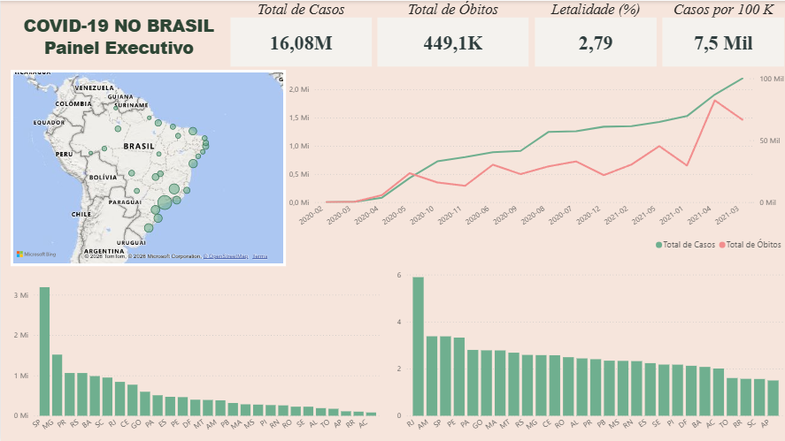
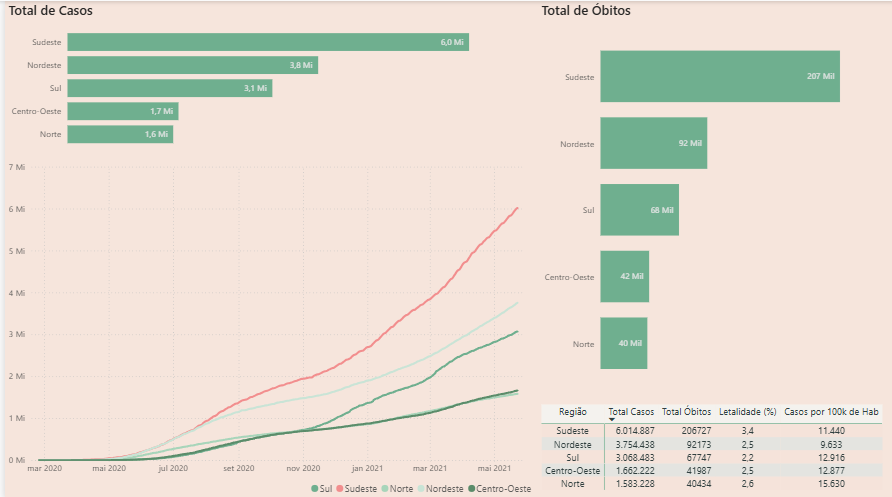
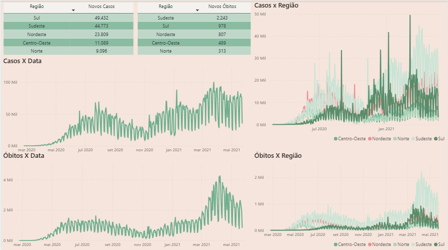
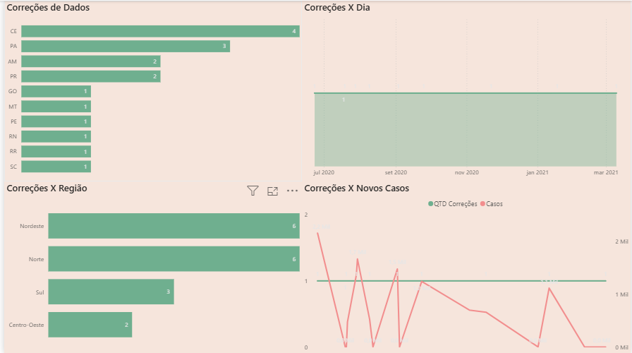
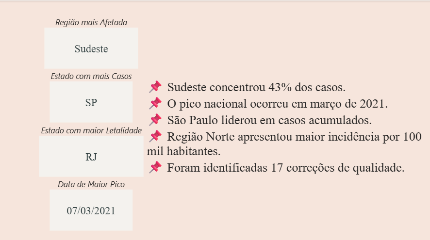

# 🦠 COVID-19 no Brasil — Casos, Óbitos e Desigualdades Regionais

> Análise exploratória da pandemia de COVID-19 no Brasil (fev/2020 a mai/2021), combinando SQL (MySQL) para limpeza e modelagem dos dados e Power BI para visualização interativa. O projeto investiga como a pandemia se distribuiu entre estados e regiões, e como esses dados se relacionam com o tamanho da população de cada local.

---

## 📑 Sumário

- [Sobre o Projeto](#-sobre-o-projeto)
- [Perguntas de Negócio](#-perguntas-de-negócio)
- [Sobre os Dados](#-sobre-os-dados)
- [Metodologia](#-metodologia)
- [Tratamento de Dados — Decisões Técnicas](#-tratamento-de-dados--decisões-técnicas)
- [Principais Achados](#-principais-achados)
- [Dashboard (Power BI)](#-dashboard-power-bi)
- [Estrutura do Repositório](#-estrutura-do-repositório)
- [Como Reproduzir](#️-como-reproduzir)
- [Glossário](#-glossário)
- [Limitações da Análise](#-limitações-da-análise)
- [Aprendizados](#-aprendizados)

---

## 📌 Sobre o Projeto

Entre fevereiro de 2020 e maio de 2021, o Brasil registrou mais de 16 milhões de casos confirmados de COVID-19 e cerca de 449 mil óbitos — números que, no entanto, não se distribuíram de forma uniforme pelo território. Estados com tamanhos populacionais muito diferentes, infraestruturas de saúde distintas e momentos diferentes de entrada na pandemia tiveram trajetórias muito distintas.

Este projeto nasceu de uma pergunta simples: **os números absolutos contam a história real, ou a "fotografia" muda quando olhamos por habitante?** A partir daí, o projeto evoluiu para uma análise estruturada, dividida em quatro frentes:

1. **Tratamento de dados** — a base bruta vem em valores acumulados e contém inconsistências reais (correções oficiais), que precisam ser identificadas e tratadas de forma documentada
2. **Modelagem em SQL** — transformação dos dados acumulados em indicadores diários e per capita, usando CTEs e window functions
3. **Análise exploratória** — investigação das 5 perguntas de negócio abaixo
4. **Visualização** — dashboard interativo em Power BI para comunicar os achados

---

## ❓ Perguntas de Negócio

| # | Pergunta | Por que importa |
|---|---|---|
| 1 | Como evoluíram os casos e óbitos ao longo do tempo? | Identifica ondas da pandemia e momentos críticos |
| 2 | Quais estados/regiões foram mais afetados (absoluto e per capita)? | Números absolutos favorecem estados grandes; per capita revela outro cenário |
| 3 | Qual a taxa de letalidade aparente por estado? | Pode indicar diferenças em testagem, subnotificação ou capacidade hospitalar |
| 4 | Existe relação entre população e taxa de casos/óbitos por habitante? | Testa a hipótese de que estados menores foram proporcionalmente mais afetados |
| 5 | Quando ocorreram os picos (ondas) por região? | Mostra que a pandemia não atingiu o país de forma simultânea |

---

## 🗂️ Sobre os Dados

**Arquivo de origem:** `brazil_covid19.csv`
**Período:** 25/02/2020 a 23/05/2021 — 454 dias corridos
**Granularidade:** 1 linha por estado (UF) por data — 27 UFs × 454 dias = 12.258 linhas
**Tipo de valor:** Acumulado (casos e óbitos totais até aquela data)

### Dicionário de dados — `brazil_covid19.csv` (origem)

| Coluna | Tipo | Descrição |
|---|---|---|
| `date` | data | Data do Registro |
| `region` | texto | Região do Brasil (Norte, Nordeste, Centro-Oeste, Sudeste, Sul) |
| `state` | texto | Sigla da UF |
| `cases` | numérico | Casos confirmados acumulados até a data |
| `deaths` | numérico | Óbitos confirmados acumulados até a data |

### Dicionário de dados — `covid19_limpo` (após tratamento)

| Coluna | Tipo | Descrição |
|---|---|---|
| `data`, `regiao`, `uf` | — | Mantidos da origem (traduzidos) |
| `cases`, `deaths` | numérico | Valores originais preservados |
| `novos_casos`, `novos_obitos` | numérico | Valores diários, calculados via `LAG()` |
| `flag_correcao_dados` | booleano | `1` se o dia apresentou queda no acumulado oficial |
| `ano`, `mes`, `semana_epi` | numérico | Derivados da data, para agregações temporais |

### Tabela complementar — `populacao_state`

| Coluna | Tipo | Descrição |
|---|---|---|
| `state` | texto | Sigla da UF (chave) |
| `populacao` | numérico | Estimativa populacional (IBGE 2022), usada para indicadores per capita |

---

## 🔄 Metodologia

O projeto segue um pipeline de 3 camadas, típico de projetos analíticos:

```
   CAMADA BRUTA              CAMADA LIMPA               CAMADA DE CONSUMO
┌───────────────────┐    ┌──────────────────────┐    ┌────────────────────┐
│  brazil_covid19   │ →  │     covid19_limpo    │  → │     views (vw_*)   │
│  (CSV original,   │    │  (valores diários,   │    │(agregações prontas │
│   sem alterações) │    │   flags de qualidade)│    │ para Power BI)     │
└───────────────────┘    └──────────────────────┘    └────────────────────┘
```

**1. Ingestão (`01_limpeza_covid.sql`)**
- Criação do banco `covid19` e da tabela `brazil_covid19`
- Importação do CSV via `TABLE DATA IMPORT WIZARD`

**2. Diagnóstico**
- Verificação de nulos, duplicatas e completude (12.258 = 454 datas × 27 UFs ✅, sem lacunas)
- Identificação de inconsistências na série acumulada (ver seção seguinte)

**3. Transformação**
- Cálculo de `novos_casos` e `novos_obitos` com `LAG() OVER (PARTITION BY uf ORDER BY data)`
- Derivação de `ano`, `mes` e `semana_epi` para agregações temporais
- Criação da tabela `covid19_limpo`, com flag de qualidade

**4. Análise Exploratória (`02_analise_exploratoria_covid.sql`)**
- 11 queries organizadas pelas 5 perguntas de negócio, usando CTEs, `RANK()`, `LAG()` e médias móveis (`ROWS BETWEEN`)

**5. Modelagem para BI (`03_views_power_bi_covid.sql`)**
- 6 views especializadas, cada uma alimentando um visual específico do dashboard

**6. Visualização (Power BI)**
- Importação das views via conector MySQL nativo
- Medidas DAX para KPIs, rankings e textos dinâmicos (`04_medidas_dax_covid.txt`)

---

## 🔧 Tratamento de Dados — Decisões Técnicas

Esta seção documenta um problema real encontrado na base e a decisão tomada para resolvê-lo — algo que costuma ser omitido em portfólios, mas que é exatamente o tipo de raciocínio que se espera de um analista no dia a dia.

### O problema

A base traz valores **acumulados** (o total de casos/óbitos "até aquela data"). Ao calcular o valor diário (`valor_hoje - valor_ontem`), o esperado é que o resultado seja sempre ≥ 0 — afinal, não existe "óbito negativo".

No entanto, foram encontradas **17 ocorrências, em 10 estados, onde o valor acumulado caiu de um dia para o outro**. Isso normalmente acontece quando órgãos de saúde **revisam e corrigem retroativamente** o total oficial (ex.: remoção de casos duplicados ou reclassificação de óbitos).

### As opções consideradas

| Opção | Prós | Contras |
|---|---|---|
| Remover os dias afetados | Simples | Perde informação; quebra a continuidade da série temporal |
| Manter o valor negativo | Preserva o dado "como está" | Distorce gráficos de tendência e médias móveis |
| **Zerar o valor diário negativo + flag de transparência** ✅ | Preserva a série temporal e o acumulado oficial; deixa claro onde houve correção | Pequena perda de precisão pontual (17 de 12.258 registros = 0,14%) |

### A decisão

Optou-se pela terceira abordagem:
- O **valor acumulado original nunca é alterado** — ele é a fonte oficial e deve ser preservado
- O **valor diário negativo é zerado** (`GREATEST(valor, 0)`), evitando distorções em gráficos de tendência e médias móveis
- Uma coluna `flag_correcao_dados` marca esses 17 registros, permitindo que qualquer pessoa que use o dashboard veja exatamente onde e quando houve correções (view `vw_qualidade_dados`)

Essa decisão prioriza a **transparência** sobre a **limpeza "invisível"** dos dados — uma escolha deliberada para um contexto de saúde pública, onde decisões tomadas com base nesses números têm impacto real.

---

## 📊 Principais Achados

> Todos os números abaixo se referem à última data disponível na base: **23/05/2021**.

### Visão Geral Nacional

| Indicador | Valor |
|---|---|
| Casos acumulados | 16.083.258 |
| Óbitos acumulados | 449.068 |
| Letalidade nacional | 2,79% |
| Casos por 100 mil habitantes | ~7.668 |
| Óbitos por 100 mil habitantes | ~214 |

### Casos e óbitos por região (absoluto)

| Região | Casos | Óbitos |
|---|---|---|
| Sudeste | 6.014.887 | 206.727 |
| Nordeste | 3.754.438 | 92.173 |
| Sul | 3.068.483 | 67.747 |
| Centro-Oeste | 1.662.222 | 41.987 |
| Norte | 1.583.228 | 40.434 |

➡️ Em números absolutos, **Sudeste e Nordeste concentram mais da metade dos casos** — coerente com sua maior população.

### A "fotografia muda" quando olhamos por habitante

| Top 5 — Casos por 100 mil hab. | Valor |
|---|---|
| RR (Roraima) | ~15.630 |
| DF (Distrito Federal) | ~14.144 |
| AP (Amapá) | ~13.054 |
| RO (Rondônia) | ~12.414 |
| SC (Santa Catarina) | ~12.173 |

➡️ **Nenhum desses estados aparece entre os líderes em números absolutos.** Roraima, Amapá e Rondônia — estados pequenos e do Norte — têm as **maiores taxas de contágio por habitante** do país, um achado que passaria despercebido em uma análise puramente de totais.

### Letalidade — grandes diferenças entre estados

| Estado | Letalidade |
|---|---|
| RJ (Rio de Janeiro) | 5,89% |
| AM (Amazonas) | 3,38% |
| SP (São Paulo) | 3,38% |
| PE (Pernambuco) | 3,32% |
| PA (Pará) | 2,80% |

No outro extremo, estados como **AP, SC, RR e TO** apresentam letalidade entre **1,5% e 1,6%** — menos da metade da taxa do RJ. Essa diferença de mais de 4 pontos percentuais entre RJ e AP é grande demais para ser explicada só por fatores clínicos, e provavelmente reflete diferenças em **testagem, subnotificação e capacidade hospitalar** entre estados (ver seção de Limitações).

### Picos (ondas) por região

| Região | Pico de novos casos | Data |
|---|---|---|
| Sul | 49.432 | 07/03/2021 |
| Sudeste | 44.773 | 01/04/2021 |
| Nordeste | 23.809 | 16/04/2021 |
| Centro-Oeste | 11.089 | 24/03/2021 |
| Norte | 9.096 | 23/06/2020 |

➡️ A maioria das regiões teve seu pico de casos concentrado em **março/abril de 2021** (a chamada "segunda onda"), com exceção do **Norte**, cujo pico ocorreu já em **junho de 2020** — provavelmente associado ao colapso do sistema de saúde de Manaus na primeira onda.

O **pico nacional de novos óbitos** (média móvel de 7 dias) ocorreu em **12/04/2021**, com média de **~3.124 óbitos/dia** — o momento mais crítico da pandemia no Brasil dentro do período analisado.

### Qualidade dos dados

- **17 registros (0,14% da base)** apresentaram correção no acumulado oficial, distribuídos em **10 estados**
- Esses registros foram tratados e estão documentados na view `vw_qualidade_dados`, garantindo que o tratamento não "escondeu" inconsistências, apenas as tornou visíveis e não-distorcivas

---

## 📈 O Dashboard (Power BI)

O painel interativo foi desenhado com foco na experiência do usuário (UX), eliminando ruídos visuais, utilizando uma paleta de cores sóbria (tons de verde e cinza) e estruturando as informações em páginas complementares para guiar a leitura do usuário.

### 1. Visão Geral & Comparativo Regional
* **Objetivo:** Apresentar a fotografia macro do país e o contraste entre os estados.
* **Estrutura Visual:** Centraliza cartões de KPI com os grandes números nacionais (Casos, Óbitos, Letalidade e Incidência por 100 mil habitantes). 
* **Destaque Analítico:** Tabela de ranking regional limpa e sem ruídos, exibindo os dados de novos casos e óbitos perfeitamente ordenados de forma decrescente, permitindo identificar os polos críticos instantaneamente de forma visual.

### 2. Ondas da Pandemia
* **Objetivo:** Demonstrar o comportamento do vírus ao longo do tempo e a assincronia regional.
* **Estrutura Visual:** Gráficos de área temporais contínuos exibindo o comportamento das curvas de contágio diárias e médias móveis.
* **Destaque Analítico:** As tabelas superiores de apoio mostram com precisão matemática os picos exatos de cada região (como o pico do Sul com 49k casos e o do Norte com 9k). A eliminação de colunas redundantes permitiu que a própria ordenação natural das linhas funcionasse como um ranking visual limpo.

### 3. Qualidade dos Dados
* **Objetivo:** Auditoria interna e transparência metodológica sobre a base de dados.
* **Estrutura Visual:** Gráficos de barras à esquerda mapeando as correções por Estado (liderado pelo Ceará) e por Região (empate de Norte e Nordeste).
* **Destaque Analítico:** Um gráfico de **Duplo Eixo** no canto inferior direito cruza a linha de tendência de `Novos Casos` com barras horizontais de `Qtd Correções` ao longo do tempo. Isso comprova visualmente que os erros de notificação aconteciam logo após os momentos de sobrecarga hospitalar e picos de infecção.

### 4. Insights de Negócio
* **Objetivo:** Consolidação executiva das principais descobertas para tomadores de decisão.
* **Estrutura Visual:** Layout em formato de apresentação executiva com fundo contrastante, utilizando blocos brancos para destacar os principais recordes (Região mais afetada, Estado com mais casos, Estado com maior letalidade e Data do maior pico).
* **Destaque Analítico:** Lista de tópicos dinâmicos com marcadores (*pins*), amarrando todas as verdades matemáticas descobertas nas abas anteriores (como o Sudeste concentrando 43% dos casos e a identificação exata das 17 correções de qualidade).

---

## 📸 Demonstração Visual

### 1. Visão Geral e Comparativo Regional



---

### 2. Ondas da Pandemia


---

### 3. Qualidade e Auditoria de Dados


---

### 4. Painel de Insights Executivos


---

## 📁 Estrutura do Repositório

```
COVID19BRASIL/
├── README.md
├── data/
│   ├── brazil_covid19.csv      ← dados originais
│   ├── covid19_limpo.csv       ← dados tratados no banco de dados (saída da limpeza)
│   └── populacao_state.csv     ← população por estado no banco de dados (IBGE 2022)
├── sql/
│   ├── limpeza_covid.sql
│   ├── analise_exploratoria_covid.sql
│   └── views_covid.sql
└── powerbi/
    └── covid19_no_brasil.pbix
```

---

## ▶️ Como Reproduzir

**Pré-requisitos:** MySQL 8+ (necessário para window functions e CTEs) e Power BI Desktop.

```
1. Clone o repositório

# 2. Crie o banco, importe os dados e aplique a limpeza

# 3. (Opcional) Execute as queries de análise exploratória

# 4. Crie as views para o Power BI

# 5. No Power BI Desktop:
#    Obter Dados → MySQL → servidor: localhost → banco: covid19
#    Importe vw_fato_covid e as demais views vw_*
#    Crie as medidas DAX.
```
## 📖 Glossário

- **Casos/óbitos acumulados:** total desde o início da pandemia até a data do registro.
- **Novos casos/óbitos:** diferença entre o acumulado de um dia e do dia anterior (valor diário).
- **Per capita (por 100 mil habitantes):** normalização que permite comparar locais com populações muito diferentes.
- **Letalidade:** percentual de óbitos em relação aos casos *confirmados* (≠ mortalidade, que seria em relação à população total).
- **Semana epidemiológica:** padrão usado por órgãos de saúde para agrupar dados por semana, facilitando comparações entre anos.
- **Onda:** período de aumento acentuado e sustentado de novos casos/óbitos.

---

## ⚠️ Limitações da Análise

- **Letalidade ≠ mortalidade real:** a taxa de letalidade depende da quantidade de testes realizados. Estados com menos testagem podem subestimar casos leves, inflando artificialmente a letalidade aparente.
- **Dados oficiais, sujeitos a subnotificação:** principalmente no início da pandemia (2020), quando a testagem era mais restrita.
- **Período limitado:** a base cobre até maio/2021, não incluindo ondas posteriores (ex.: variante Ômicron).
- **População fixa (IBGE 2022):** usada como referência única para todo o período, embora a população real varie ano a ano.

---

## 🧠 Aprendizados

- Transformação de dados acumulados em valores diários usando window functions (`LAG`).
- Identificação, quantificação e tratamento de inconsistências reais em dados governamentais, com decisão técnica documentada e justificada.
- Construção de indicadores per capita via `JOIN` com tabela de população, revelando achados que números absolutos escondem.
- Uso de `RANK()` e CTEs para identificar picos (ondas) por subgrupo (região).
- Modelagem de views especializadas, cada uma já pronta para um visual específico no Power BI.
- Importância de comunicar **limitações** de uma análise, não apenas resultados.

---

## 👩‍💻 Autora

**Laura** - Analista de Dados Jr
[LinkedIn](https://www.linkedin.com/in/laurasesca/) · [GitHub](https://github.com/laurases)
